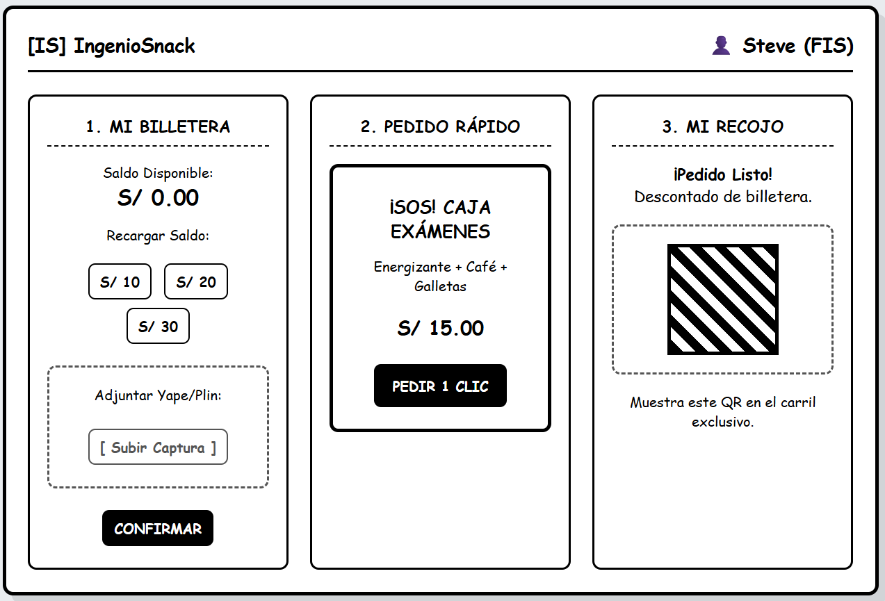

# Semana 11: Design Thinking - IngenioSnack

## Fase 1: EMPATIZAR (Investigación de Usuario)
Se realizaron 3 entrevistas a estudiantes de la FIS.
*(Inserta aquí tu imagen del Mapa de Empatía. Código de ejemplo: ``)*

## Fase 2: DEFINIR (El Problema Central)
**Point of View (POV):** "El estudiante de la FIS con alta carga académica necesita una forma predecible e inmediata de asegurar su refrigerio sin hacer fila, porque la incertidumbre del tiempo de espera le genera ansiedad y le hace perder tiempo valioso que necesita para sus clases y laboratorios."

## Fase 3: IDEAR (Lluvia de Soluciones)
Se realizó una lluvia de ideas para listar soluciones:
1. Suscripción "Fast-Pass" Digital.
2. Caja "Gamer / Amanecida" con energizantes.
3. Bot de Pedidos con IA en WhatsApp.
4. Sistema de "Logros Desbloqueados" por puntualidad.
5. Casilleros Inteligentes (Smart Lockers).
6. Caja "Estudiante Becario" (menú económico).
7. Suscripción de Escuadrón (compras grupales).
8. Catálogo 360º de Snacks.
9. Alarma de Inventario en Tiempo Real.
10. Delivery Estudiantil "Peer-to-Peer".

**Las 2 mejores ideas elegidas por el equipo:**
1. Suscripción "Fast-Pass" Digital (Elegida para prototipar por su viabilidad tecnológica).
2. Caja Sorpresa "Amanecida / Exámenes" (Ataca el desgaste mental).

## Fase 4: PROTOTIPAR (Baja Fidelidad)
Se diseñó un wireframe digital de la "Suscripción Fast-Pass" adaptado a una interfaz de laptop. El prototipo muestra un panel de control de usuario para un estudiante de la FIS, permitiéndole visualizar y elegir entre los dos planes de suscripción (Pase Semanal y Caja Sorpresa de Exámenes) con sus respectivos precios. Una vez suscrito, el panel integra un código QR dinámico que el estudiante debe mostrar en la ventanilla exclusiva de IngenioSnack para el recojo instantáneo, eliminando la fila tradicional. El diseño incluye barra de búsqueda, perfil de usuario (Mateo, FIS) e historial de pagos.

## Fase 5: TESTEAR (Validación con Usuario)
Se mostró el prototipo a 2 estudiantes reales (Sebastian Tovar y Francis Inga) para recoger su feedback.

| Usuario Evaluador | Qué le gustó | Qué no le gustó | Qué dudas tuvo el usuario |
| :--- | :--- | :--- | :--- |
| **Estudiante 1:** Sebastian Tovar | La idea de llegar, escanear el QR y llevarse la comida sin hacer fila. El botón de la "Caja Exámenes" le pareció genial. | Le pareció que subir la captura de pago manual en la app toma muchos pasos. | "¿Qué pasa si llego tarde a mi hora de recojo? ¿Mi sándwich se enfría o se lo dan a otro?" |
| **Estudiante 2:** Francis Inga | Saber exactamente cuántos panes de pollo quedan desde su celular antes de bajar al quiosco. | La "Caja Sorpresa" no le convence si no sabe exactamente qué bebida energética incluye. | "¿El Sr. Julio realmente va a respetar el carril exclusivo si hay mucha gente esperando en la fila normal?" |